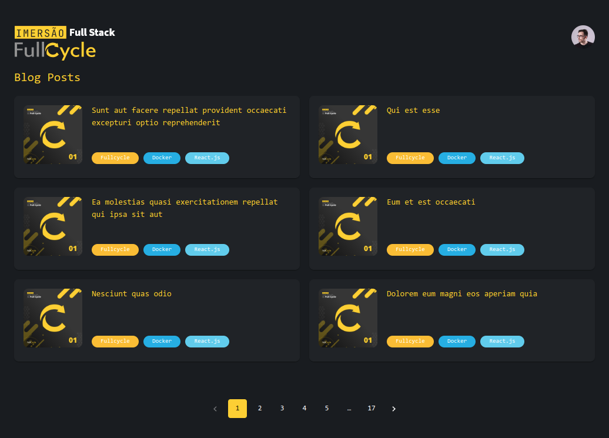

# Imersão Fullcycle 8 - Desafio React.js


Desafio React.js: https://github.com/jeziellopes/fullcycle-posts



## Requirements

* Use Material-UI
* List only post title (main route)
* Redirect to post on click (secondary route)

## How to run

```bash
  # install dependencies
  npm install

  # start project
  npm start
```

## Informações do desafio

Neste desafio você precisa criar uma página com React.js que liste os posts do endereço ```https://jsonplaceholder.typicode.com/posts```.

A estilização precisa ser feita com o Material UI, utilize sua criatividade para listar os posts de maneira elegante. Na listagem deve ter apenas o título do post.

Ao clicar em um item da listagem precisamos ser redirecionado para uma página que mostre o título e o conteúdo do post escolha.

Disponibilize a aplicação em um repositório Git que permita-se roda-la em http://localhost:3000 ao fazer os comandos npm install e npm start

Bons estudos!